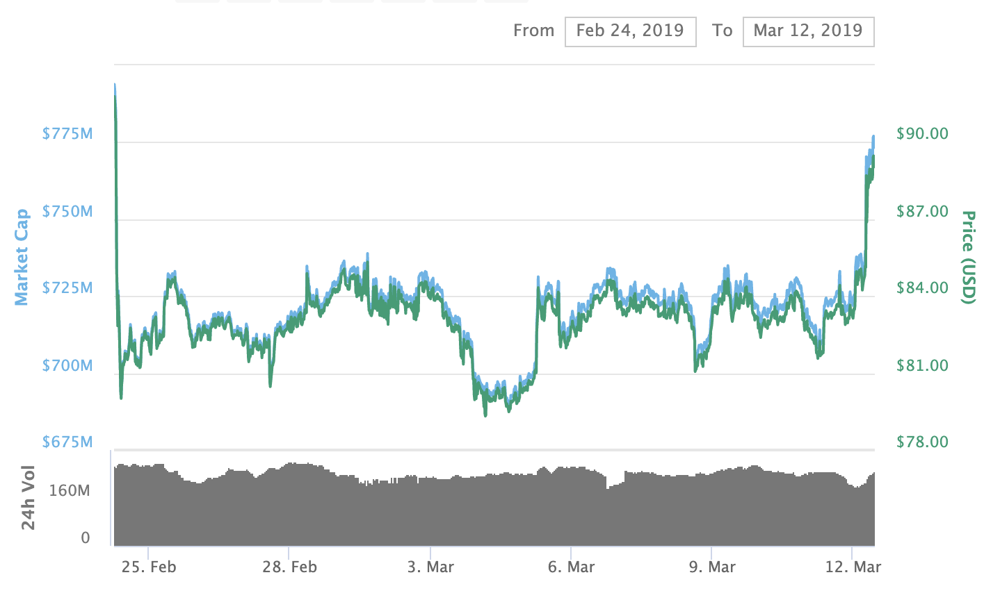
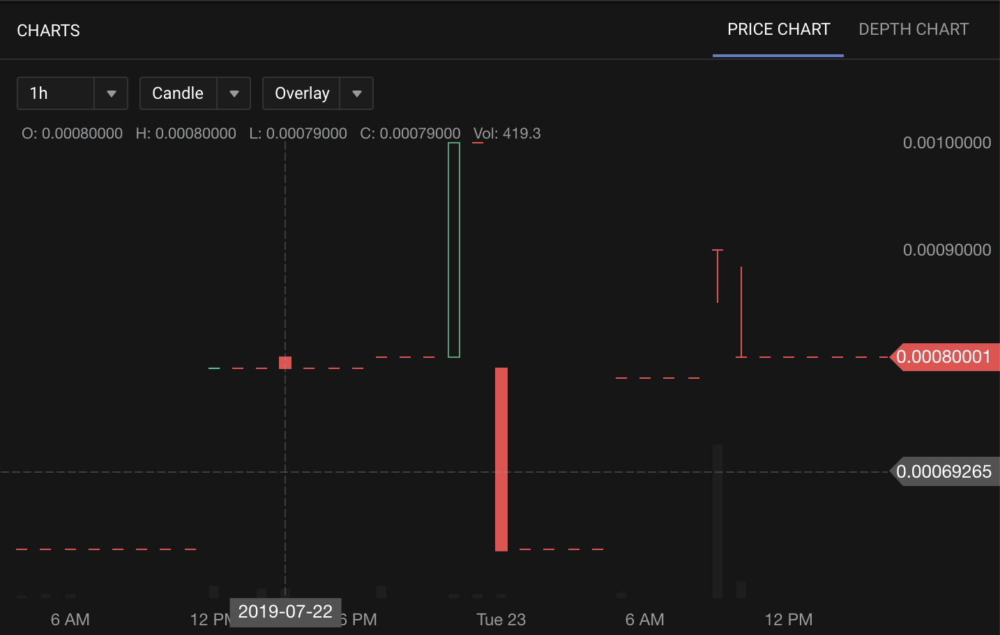
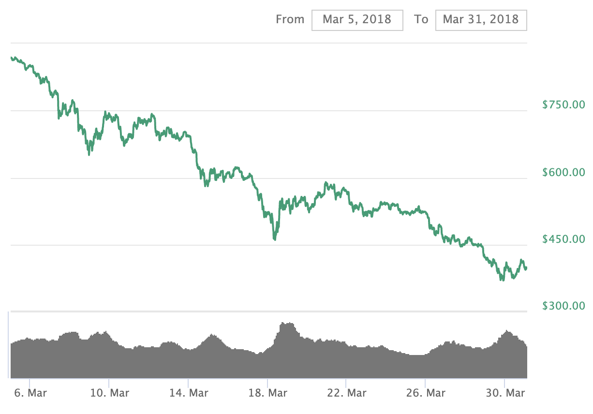

Below is a summary of frequently asked questions regarding Hummingbot.  If you have additional questions or need support, please join the official [Hummingbot Discord server](https://discord.hummingbot.io) or email us at [support@hummingbot.io](mailto:support@hummingbot.io).

### What is Hummingbot?

[Hummingbot](http://hummingbot.io) is open source software that helps you build and run market making bots. For more detailed information, please read the [Hummingbot whitepaper](https://www.hummingbot.io/hummingbot.pdf).

### Why are you making Hummingbot available to the general public rather than just running it in-house?

We make money by administering [Liquidity Mining](/liquidity-mining) programs, which allow token projects to source liquidity from a decentralized network rather than from a single firm. Hummingbot is a free tool that anyone can use to participate in liquidity mining.

### Why are you making Hummingbot open source?

**Trust and Transparency**. In order to use crypto trading bots, users must provide their private keys and exchange API keys. An open source codebase enables anyone to inspect and audit the code.

### How much cryptocurrency do I need to get started?

There is no minimum amount of assets to use Hummingbot, but users should pay heed to exchange-specific minimum order sizes. In our [exchange connectors](/connectors) documentation, we include links to the exchange's minimum order size page where available.

### Are my private keys and API keys secure?

Since Hummingbot is a local client, your private keys and API keys are as secure as the computer you are running them on.  The keys are used to create authorized instructions locally on the local machine, and only the instructions which have already been signed or authorized are sent out from the client.

Always use caution and make sure the computer you are running Hummingbot on is safe, secure, and free from unauthorized access.

### What does it cost for me to run Hummingbot?

Hummingbot is a free software, so you can download, install, and run it for free.

Transactions from Hummingbot are normal transactions conducted on exchanges; therefore when operating Hummingbot, you would be subject to each exchange’s fees (e.g. maker, taker, and withdrawal fees), as you would if you were trading on that exchange normally (i.e. without Hummingbot).

### What is market making?
Market making is the act of simultaneously creating buy and sell orders for an asset in a market. By doing so, a market maker acts as a liquidity provider, facilitating other market participants to trade by giving them the ability to fill the market maker's orders. Traditionally, market making industry has been dominated by highly technical quantitative hedge funds and trading firms who have the infrastructure and intelligence to deploy sophisticated algorithms at scale.

Market makers play an important role in providing liquidity to financial markets, especially in the highly fragmented cryptocurrency industry. While large professional market makers fight over the most actively traded pairs on the highest volume exchanges, there exists a massive **long tail of smaller markets** who also need liquidity: tokens outside the top 10, smaller exchanges, decentralized exchanges, and new blockchains.

In addition, the prohibitively high payment demanded by pro market makers, coupled with lack of transparency and industry standards, creates perverse incentives for certain bad players to act maliciously via wash trading and market manipulation. For more discussion on the liquidity problem, please check out [this blog post](https://www.hummingbot.io/blog/2019-01-thin-crust-of-liquidity/).

### How does market making work?

>Warning: Not financial or investment advice.  Below are descriptions of some risks associated with the pure market making strategy.  There may be additional risks not described below.

#### Ideal case

Market making strategies works best when you have a market that's relatively calm, but with sufficient trading activity. What that means for a pure market makers is, he would be able to get both of his bid and ask offers traded regularly; the price of his inventory doesn't change by a lot so there's no risk of him ending up on the wrong side of a trend. Thus he would be able to repeatedly capture small profits via the bid/ask spread over time.

In the figure above, the period between 25 Feb and 12 Mar would be an example of the ideal case. The price of the asset stayed within a relatively small range, and there was sufficient trading activity for a market maker's offers to be taken regularly.

The only thing a market maker needs to worry about in this scenario is he must make sure the trading spread he sets is larger than the trading fees given to the exchange.

#### Low trading activity

Markets with low trading activity higher risk for pure market making strategies. Here's an example:

In any market with low trading activity, there's a risk where the market maker may need to hold onto inventory for a long time without a chance to trade it back. During that time, the prices of the traded assets may rise or drop dramatically despite seeing no or little trading activity on the exchange. This exposes the market maker to inventory risk, even after mitigating some of this risk by using wider bid spreads.

Other strategies may be more suitable from a risk perspective in this type of market, e.g. [cross-exchange market making](/strategies/cross-exchange-market-making).

#### Market/inventory risk due to low volatile or trending markets

Another common risk that market makers need to be aware of is trending markets. Here's one example:

If a pure market maker set his spreads naively in such a market, e.g. equidistant bid/ask spread, there's a risk of the market maker's bid consistently being filled as prices trend down, while at the same time the market continues to move away from the market maker's ask, decreasing the probability of sells.  This would result in an accumulation of inventory at exactly the time where this would reduce inventory value, which is "wrong-way" risk.

However, it is still possible to improve the probability of generating profits in this kind of market by skewing bid asks, i.e. setting a wider bid spread (e.g. -4%) than ask spread (e.g. +0.5%).  In this way, the market maker is trying to catch price spikes in the direction of the trend and buy additional inventory only in the event of a larger moves, but sell more quickly when there is an opportunity so as to minimize the duration the inventory is held.  This approach also has a mean reversion bias, i.e. buy only when there is a larger move downwards, in the hopes of stabilization or recovery after such a large move.

Market making in volatile or trending markets is more advanced and risky for new traders. It's recommended that a trader looking to market make in this kind of environment to get mentally familiar with it (e.g. via paper trading) before committing meaningful capital to the strategy.

### Besides market risk, what other risks does a market maker face?

There are many moving parts when operating a market making bot that all have to work together in order to properly function:

- Hummingbot code
- Exchange APIs
- Ethereum blockchain and node
- Network connectivity
- Hummingbot host computer

A fault in any component may result in bot errors, which can range from minor and inconsequential to major.

It is essential for any market making bot to be able to regularly refresh its bid and ask offers on the market in order to adjust to changing market conditions.  If a market making bot is disconnected from the exchange for an extended period of time, then the bid/ask offers it previously made would be left on the market and subject to price fluctuations of the market. Those orders may be filled at a loss as market prices move, while the market maker is offline.  It is very important for any market maker to make sure technical infrastructure is secure and reliable.
